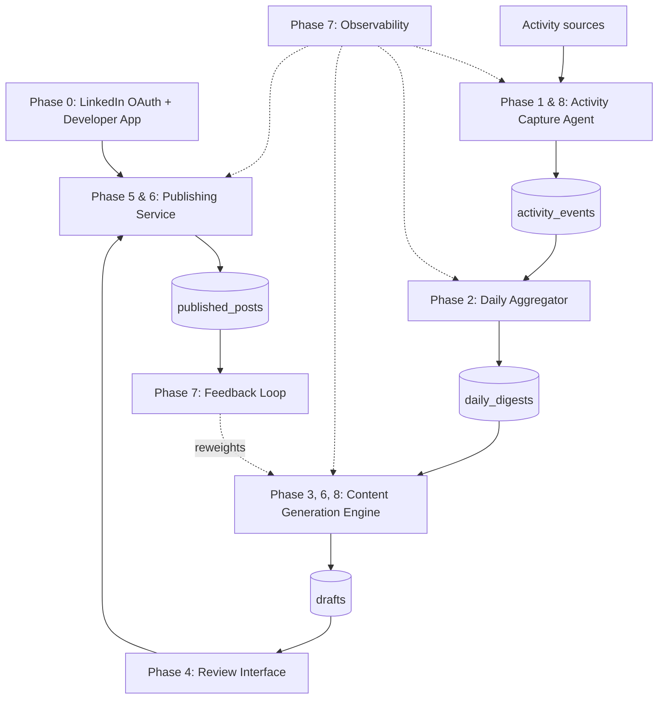

# LinkedIn Content Agent — Track A
## Phase-by-phase implementation roadmap (v2)

This is a build-order companion to `linkedin_agent_track_a.md` (the full architecture reference, now at v3). Each phase below specifies what gets built, which part of the architecture it covers, the tech stack involved, concrete tasks, and a definition of done — so you can work through it sequentially and know when each phase is actually finished.

---

## Architecture map by phase

---

## Phase 0 — LinkedIn Developer Setup & OAuth

**Goal:** Validate the highest-risk external dependency before building anything else.

**Architecture covered:** Authentication layer underlying Component 6 (Publishing Service).

**Tech stack:** `requests`, `keyring`, `python-dotenv`

**Tasks:**
- Create (or designate) a LinkedIn company Page — required to register a developer app, even for personal use.
- Create the app at the LinkedIn Developer Portal; add "Sign In with LinkedIn using OpenID Connect" and "Share on LinkedIn" products.
- Configure OAuth redirect URI (`http://localhost:8000/callback` for local dev).
- Implement `publisher/oauth.py`: `get_auth_url()`, `exchange_code_for_token()`, `refresh_access_token()`.
- Implement token storage via `keyring` (no plaintext tokens anywhere).
- Set up `.env` for `CLIENT_ID`, `CLIENT_SECRET`, `LINKEDIN_VERSION`, and `DRY_RUN`.
- Write `publisher/linkedin_client.py` with a minimal `post_text()` and a `delete_post()`.
- Manually run the OAuth flow once, post a "hello world" text post, confirm it on your profile, then delete it.

**Definition of done:** You have a real access token + refresh token stored in the keyring, and you've successfully posted and deleted one real post via the API.

**Estimated effort:** 2-4 hours (mostly portal configuration and waiting for OAuth redirects to work locally).

---

## Phase 0.5 — Local-only End-to-End Dry Run

**Goal:** Validate the full pipeline architecture with fake data before connecting real activity sources. Catches integration issues early.

**Architecture covered:** All components in skeleton form — database, digest, generation, review (terminal-based), publish (dry run).

**Tech stack:** `sqlite3`, `anthropic`, `click`, `python-dotenv`, `zoneinfo`

**Tasks:**
- Seed `activity_events` with 3-5 days of hand-written sample events covering different sources (calendar, git, notes).
- Run the digest → generate → review (CLI-based, since Telegram isn't set up yet) → publish (DRY_RUN) loop end-to-end.
- Implement `cli.py` with basic `digest`, `generate`, `review`, `publish`, and `health-check` subcommands using `click`.
- Configure `LOCAL_TIMEZONE` in `.env` and verify that scheduling logic computes UTC times correctly for your timezone.
- Verify that the `content_queue` correctly spaces multiple drafts across posting windows with jitter.

**Definition of done:** You can run `python cli.py digest --date 2026-06-14 && python cli.py generate --date 2026-06-14 && python cli.py review && python cli.py publish --dry-run` and see the full pipeline execute with realistic output — drafts generated, review prompted in terminal, publish logged.

**Estimated effort:** 2-4 hours.

> **This phase can run in parallel with Phase 0** (OAuth setup). Phase 0 has zero code dependency on Phase 0.5 and vice versa. If OAuth hits a snag (company page verification delays, etc.), you still have a working local pipeline.

---

## Phase 1 — Database & Initial Activity Capture

**Goal:** Get raw activity events flowing into a well-structured local database.

**Architecture covered:** Component 1 (Activity Capture Agent) — calendar and notes sources only; Component 8's schema foundations (pragmas, indexes). ActivityWatch is **not** required here.

**Tech stack:** `sqlite3`, `google-api-python-client` (Calendar), `PyYAML`, `APScheduler`, `zoneinfo`

**Tasks:**
- Write `db/schema.sql`: `activity_events` table, `content_queue` table, plus `PRAGMA foreign_keys = ON` and the core indexes from Section 11 of the architecture doc.
- Write `db/db.py`: connection helper that sets `PRAGMA foreign_keys = ON` per connection.
- Write `config/exclusions.yaml` with your initial exclusion rules (apps, domains, calendar patterns, folders — using `~`-relative paths).
- Write `config/posting_cadence.yaml` with the cadence rules (max posts/day, posting windows, jitter).
- Configure `LOCAL_TIMEZONE` in `.env`; all scheduling uses `zoneinfo` from this point forward.
- Implement `capture/calendar_watcher.py`: pulls events via Google Calendar API, applies exclusions, writes to `activity_events`.
- Implement `capture/notes_watcher.py`: reads a simple daily notes file (or a Telegram message you send yourself) and writes a `note` event.
- Wire both into `orchestrator.py` via APScheduler, running every 30-60 minutes during waking hours.

**Definition of done:** After running for a few days, `activity_events` contains a believable record of your calendar and notes, with excluded items genuinely absent (verify by checking the DB directly, not just the output).

**Estimated effort:** 1-2 days.

---

## Phase 2 — Daily Digest Generation

**Goal:** Turn a day's raw events into a structured, LLM-generated summary.

**Architecture covered:** Component 2 (Daily Aggregation & Digest).

**Tech stack:** `anthropic` Python SDK, structured outputs (`output_config.format`, `type: json_schema`)

**Tasks:**
- Write `aggregator/daily_digest.py`: query the day's `activity_events`, group/collapse by source (e.g. collapse 40 file edits into one summary line).
- Define the digest JSON schema: `highlights` (array of strings), `categories` (object), `suggested_pillar` (enum incl. `none`).
- Call Claude with `output_config={"format": {"type": "json_schema", "schema": digest_schema}}`.
- Insert the result into `daily_digests` (with `date`/`version`/`UNIQUE(date, version)` as specified in the architecture doc).
- Add this job to `orchestrator.py`, scheduled for ~21:00 daily.

**Definition of done:** Running the job for a real day produces a digest that, read on its own, you'd recognize as "yes, that's roughly what I did today" — and re-running it for the same date creates `version = 2` rather than erroring.

**Estimated effort:** 1 day.

---

## Phase 3 — Voice Profile & Text Content Generation

**Goal:** Generate draft LinkedIn posts, in your voice, from the daily digest.

**Architecture covered:** Component 3 (Voice Profile) and Component 4 (Content Generation Engine) — `text` format only.

**Tech stack:** `anthropic` SDK, `PyYAML`, `pytest`

**Tasks:**
- Export 15-25 of your past LinkedIn posts (manual export, since `r_member_social` is restricted); send them to Claude in a one-off prompt to produce `config/voice_profile.md`. Git-commit this file; future drafts will reference its SHA-256 content hash.
- Write `config/pillars.yaml` (the four pillars: technical_insight, project_milestone, lesson_learned, industry_commentary).
- Implement `generator/pillar_classifier.py`: structured-output call that picks a pillar (or `none`) given the digest + recent pillar history. Allow `primary_pillar` + optional `secondary_pillar` for days that span two themes.
- Implement `generator/draft_generator.py`: structured-output call producing 1-3 text variants (per the schema/example in Section 5c of the architecture doc), tagged with `voice_profile_hash`. Include the last 7-14 published `text_content` entries in the system prompt to prevent thematic repetition.
- Add post-generation validation: warn if any variant exceeds 1300 chars (style target), reject if >3000 chars (LinkedIn hard limit).
- Insert results into `drafts` with `status = 'pending_review'`, `format_type = 'text'`.
- Write `tests/test_pillar_classifier.py` covering pillar-repetition avoidance, the `none` case, and dual-pillar scenarios using fixture digests.

**Definition of done:** For a real day's digest, the pipeline produces 1-3 text drafts that sound recognizably like you, correctly tagged with a pillar, with pillar-history logic verified by tests. Drafts pass character count validation.

**Estimated effort:** 1-2 days.

---

## Phase 4 — Review Bot + Multi-Channel Notifications

**Goal:** Human-in-the-loop approval via multiple channels, with editing.

**Architecture covered:** Component 5 (Human Review Interface), Notification Router.

**Tech stack:** `python-telegram-bot`, `smtplib`, `click`

**Tasks:**
- Implement `notification/router.py`: `NotificationChannel` abstract base, `NotificationRouter` with ordered channel fallback + local queue.
- Implement `notification/telegram_channel.py`: sends daily message with digest highlights + draft text(s) + inline `Approve | Edit | Skip` buttons. Add `TELEGRAM_ALLOWED_USER_IDS` whitelist and 5-second debounce on button callbacks.
- Implement `notification/email_channel.py`: sends HTML-formatted draft via SMTP; supports reply-to-approve.
- Extend `cli.py` with `review` subcommand: `--approve`, `--edit`, `--skip` flags for offline review from `pending_reviews` table.
- **Approve** → `drafts.status = 'approved'`, draft enters `content_queue` with `scheduled_time` computed from `posting_cadence.yaml` rules.
- **Edit** → channel asks for a free-text instruction, re-invokes `draft_generator` with that instruction appended, sends back the revision for another approve/edit/skip.
- **Skip** → `status = 'rejected'`, with the pillar logged so history isn't skewed.

**Definition of done:** A real draft arrives on your phone (Telegram) in the evening; you can approve, edit (and get a meaningfully revised draft back), or skip, and the `drafts` table + `content_queue` reflect the outcome correctly. If Telegram is disabled, the same flow works via `python cli.py review`.

**Estimated effort:** 1 day.

---

## Phase 5 — Publishing Service + Content Queue (MVP milestone)

**Goal:** Close the loop end-to-end for text posts with natural posting cadence — this is the first fully working pipeline.

**Architecture covered:** Component 6 (Publishing Service) — text posts, idempotent state machine, content queue with batching.

**Tech stack:** `requests`, `APScheduler`, `zoneinfo`

**Tasks:**
- Extend `publisher/linkedin_client.py` with the full `post_text()` from Section 7c, using `headers()` (token from keyring + `LinkedIn-Version`).
- Implement the idempotent `publish_due_drafts()` and `reconcile_stuck_publishes()` state machine from Section 7d (`pending_review → approved → publishing → published/failed/needs_manual_check`).
- Wire the content queue publisher: reads from `content_queue` where `status='queued' AND scheduled_time <= now()`, respects cadence rules (max posts/day, min hours between posts).
- Implement `429` (rate limit) and `426` (version sunset) handling, with `426` pausing the run and alerting via `NotificationRouter`.
- Add `publisher/scheduler.py` to `orchestrator.py`, running every 15 minutes, with `reconcile_stuck_publishes()` called first each tick.
- Write `tests/test_publishing_integration.py`: post via `visibility: CONNECTIONS`, confirm `published_posts` row created, then `delete_post()` to clean up.
- Verify natural cadence: approve 2 drafts in the evening, confirm they publish in separate posting windows the next day with jitter applied.

**Definition of done:** You approve 1-2 drafts in the evening, and by the next day they're live on LinkedIn at natural-looking times (or, with `DRY_RUN=true`, logged exactly as they would have posted) — with no manual intervention, no double-posting on scheduler restart, and posts spaced 3+ hours apart.

**Estimated effort:** 1-2 days.

> **At this point you have a complete, working pipeline** for text posts with human-like posting cadence. Everything from here expands capability rather than completing the core loop.

---

## Phase 6 — Image & Carousel Formats

**Goal:** Add visual content types.

**Architecture covered:** Component 4 (format selection + media handling) and Component 6 (Images/Documents API).

**Tech stack:** `Pillow`/`matplotlib`, `img2pdf`

**Tasks:**
- Implement `generator/media_handler.py`: select from a tagged "screenshots of the day" folder, or generate a simple chart via `matplotlib`/`Pillow`.
- Implement `generator/format_selector.py`: structured-output call choosing `text | image | carousel | long_form` based on digest + available media (per the heuristic in Section 5b).
- Add `upload_image()` to `linkedin_client.py` (Images API, two-step upload).
- Add `upload_carousel()`: compose slide images to a single PDF via `img2pdf`, upload via the Documents API `initializeUpload` flow.
- Extend `drafts.media_refs_json` handling in the publisher to dispatch by `format_type`.

**Definition of done:** The pipeline produces and successfully publishes both an `image` post and a `carousel` (document) post, end to end through the same review/publish flow as text.

**Estimated effort:** 2-3 days.

---

## Phase 7 — Feedback Loop & Observability

**Goal:** Close the performance loop and add monitoring so failures don't go unnoticed.

**Architecture covered:** Component 7 (Weekly Feedback Loop) and the Observability layer (Section 9 of the architecture doc).

**Tech stack:** No new dependencies — `anthropic` SDK, `python-telegram-bot`, `sqlite3`.

**Tasks:**
- Add `performance_log` table; implement `feedback/weekly_review.py` — Sunday Telegram prompt asking for last week's impressions/reactions/comments per post.
- Implement a monthly Claude call cross-referencing `performance_log` with `pillar`/`format_type` to suggest reweighting.
- Add `pipeline_runs` table and the `run_component()` wrapper; apply it to every component's entry point (capture, digest, generator, publisher, feedback).
- Implement `observability/health_check.py`: daily Telegram message covering token expiry, recent activity capture, stuck drafts, and recent pipeline failures.

**Definition of done:** A week of real performance data has been entered and produced at least one reweighting suggestion; the daily health check message arrives each morning and would have caught a failure if you'd introduced one (test this by deliberately breaking one component briefly).

**Estimated effort:** 1-2 days.

---

## Phase 8 — Expansion

**Goal:** Broaden activity sources and content formats based on real usage data.

**Architecture covered:** Component 1 (additional sources) and Component 4 (additional formats), informed by Phase 7's feedback data.

**Tech stack:** `watchdog` (file watching), `GitPython` or `git log` parsing via `subprocess`

**Tasks:**
- Implement `capture/git_watcher.py` (commit/PR history) and `capture/file_watcher.py` (project folder edits via `watchdog`).
- Optionally enable ActivityWatch integration (`ACTIVITYWATCH_ENABLED=true` in `.env`) and implement `capture/aw_watcher.py` for passive app/window tracking.
- Optionally implement a `coding_session_watcher.py` if you use Claude Code/Codex CLI heavily — parsing local session logs for daily summaries.
- Add `video` format support (clip selection from a designated folder) and `poll` format support (schema with 2-4 options + duration, mapped to LinkedIn's poll content type — verify the current API shape first).
- Use Phase 7's performance data to revise pillar weightings, prompt wording in `draft_generator.py`, and posting cadence rules.

**Definition of done:** New activity sources are feeding into digests without exclusion-rule gaps; `video` and `poll` drafts can be generated and published; prompt adjustments are traceable to specific performance-log findings.

**Estimated effort:** Ongoing — treat this as the maintenance/iteration phase rather than a fixed sprint.

---

## Cumulative tech stack reference

| Category | Tools |
|---|---|
| Language & storage | Python 3.10+, SQLite (FK + indexes) |
| Activity capture | Google Calendar API, `watchdog`, `GitPython`/`subprocess`; optionally `aw-client` |
| LLM | `anthropic` SDK, structured outputs (`output_config.format`); `tenacity` for retry/backoff |
| Scheduling & timezone | `APScheduler`, `zoneinfo` (stdlib) |
| Notifications | Multi-channel router: `python-telegram-bot`, `smtplib`, local CLI queue |
| Review | Telegram bot (primary), email (fallback), `cli.py review` (offline) |
| Media | `Pillow`/`matplotlib`, `img2pdf`, ffmpeg (future) |
| Publishing | `requests`, LinkedIn REST API (Posts/Images/Documents) |
| Secrets | `keyring`, `python-dotenv` |
| Testing & DX | `pytest`, `DRY_RUN` env var, `datasette`, `click` (CLI) |
