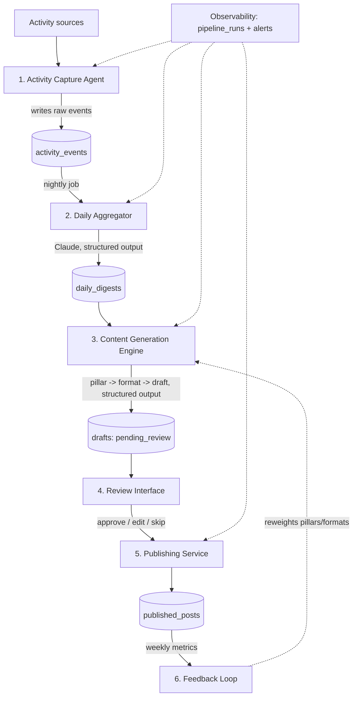

# LinkedIn Content Agent — Track A
## End-to-end architecture and implementation plan (v2)

Track A covers everything that can be run with minimal human effort and stays within LinkedIn's official API: turning your daily activity into reviewed, published posts (text, image, carousel, video, long-form). It excludes liking/commenting on other people's content (Track B), which LinkedIn's API doesn't support for automation.

---

## Revision notes (v2)

This version incorporates a review pass against current LinkedIn API docs, ActivityWatch integration patterns, and Claude API capabilities. Summary of changes:

| Area | Change |
|---|---|
| Capture agent | Use `aw-client` (REST) instead of direct SQLite access to ActivityWatch's DB; portable `~`-based exclusion paths |
| Digest schema | Allow re-running a day's digest (versioned rows) instead of one fixed row per date |
| Voice profile | Stored as a file only (`config/voice_profile.md`), not a DB table; drafts reference it via a hash |
| Content generation | All structured LLM outputs (digest summarization, pillar/format classification, draft generation) use Claude's `output_config.format` JSON-schema mode instead of free-text parsing |
| Carousel posts | Corrected: these are PDF uploads via the Documents API, not multi-image uploads |
| Polls | Deferred to a later phase rather than left half-specified in the v1 format enum |
| OAuth tokens | Stored in the OS keyring, not as plaintext SQLite columns; `oauth_tokens` becomes `oauth_token_meta` (expiry metadata only) |
| Publishing | Added `426 Upgrade Required` (API version sunset) handling, and idempotent publish state machine to prevent double-posting on crash |
| Schema | `PRAGMA foreign_keys = ON`, added indexes, `updated_at` columns |
| New sections | Observability/logging, testing strategy |
| LinkedIn access (7a) | Clarified: Share on LinkedIn / `w_member_social` is self-service via the Products tab; the real prerequisite is a verified company Page to create the app at all. The multi-week review process applies to Community Management API access (Track B), not Track A |
| Diagram | Converted to Mermaid for easier maintenance |

---

## Revision notes (v3)

Incorporates design decisions from project review.

| Area | Change |
|---|---|
| Batching | Support multiple posts per day with human-like spacing (3-6 hr jitter, max 2/day weekdays, max 1/day weekends); content queue with priority scoring |
| Timezones | All DB timestamps stored as UTC; scheduling uses `zoneinfo` with a `LOCAL_TIMEZONE` config; travel-safe |
| Voice profile | Git-versioned `config/voice_profile.md`; hash computed from file content via SHA-256 |
| ActivityWatch | Now optional — capture layer works with calendar + notes + git alone; AW adds app/window tracking if installed |
| Notifications | Multi-channel router: Telegram (primary) → Email/SMTP (fallback) → local CLI queue (last resort); decoupled from review/alerts via `NotificationRouter` |
| Review interface | Added email-based review (reply-to-approve) and CLI review (`cli.py review`) as fallbacks |
| Content queue | New `content_queue` table tracks generated drafts with priority scores and natural spacing logic |

---

## 1. Architecture overview



Everything communicates through one local SQLite database — it acts as the message bus, so each component can be a small independent script/process without needing a queue or web framework.

---

## 2. Component 1 — Activity Capture Agent

### Purpose
Continuously and passively record what you do during the day, in a form the aggregator can summarize. Runs locally; nothing leaves your machine until the daily digest step.

### Data sources (pick 2-3 to start, expand later)

- **Calendar** — Google Calendar API (or Outlook equivalent). Pull event titles, durations, and attendee *counts* (not names by default).
- **Git activity** — parse `git log` across your repos, or use the GitHub/GitLab API for PRs and merges. Strong signal for technical-insight and project-milestone content.
- **File system activity** — `watchdog` watching specific project folders for file edits/creates.
- **Browser activity** *(optional, higher privacy risk)* — only page titles for an explicit domain allowlist, never full history.
- **Notes** — a simple text file or Telegram message ("worked on X today"). Low effort, high signal — don't skip this one.
- **Email** *(optional)* — Gmail API, metadata only (subject + thread count), never body content.
- **Coding-assistant sessions** *(optional)* — local session logs from Claude Code / Codex CLI if a meaningful chunk of your day happens there; same privacy filtering applies before anything is summarized.

### Implementation approach

Each watcher is a standalone script triggered by cron / APScheduler — no need for a long-running daemon for low-frequency sources like calendar or git. All watchers write directly into the `activity_events` table via the shared SQLite DB.

**ActivityWatch integration (optional):** If you run [ActivityWatch](https://activitywatch.net/) for app/window time tracking, enable it by setting `ACTIVITYWATCH_ENABLED=true` in `.env`. The agent accesses it through the **`aw-client` Python library** (REST API, not direct SQLite access — AW's internal schema is unstable and direct writes risk corruption):

```python
from aw_client import ActivityWatchClient

client = ActivityWatchClient("linkedin-agent", testing=False)
events = client.get_events(bucket_id="aw-watcher-window_<hostname>", limit=200)
```

Without ActivityWatch, the capture layer works perfectly well using calendar + notes + git watchers alone. AW adds passive app/window tracking for richer digests but is not required for a functional pipeline.

### Privacy: exclusion rules (build this first, not last)

`config/exclusions.yaml`:

```yaml
apps:
  - "1Password"
  - "Banking"
domains:
  - "reddit.com"
  - "personal-webmail.com"
calendar_title_patterns:
  - "(?i)therapy"
  - "(?i)personal"
  - "(?i)1:1.*HR"
folders:
  - "~/Documents/Personal"
  - "~/Documents/Finance"
```

Every watcher loads this file, expands `~`/`${HOME}` at runtime, and drops matching events **before** writing to the database — exclusions should never be stored and filtered out later, since "filtered later" means the sensitive data still touched disk.

### Schema

```sql
CREATE TABLE activity_events (
    id INTEGER PRIMARY KEY AUTOINCREMENT,
    source TEXT NOT NULL,        -- 'calendar' | 'git' | 'file' | 'browser' | 'note' | 'email' | 'coding_session'
    event_time TEXT NOT NULL,    -- ISO8601
    title TEXT,
    detail TEXT,                 -- JSON blob, source-specific
    created_at TEXT DEFAULT (datetime('now'))
);
```

---

## 3. Component 2 — Daily Aggregation & Digest

### Schedule
Runs once daily (e.g. 9pm local time) via cron/APScheduler.

### Logic

1. Pull all `activity_events` for the day.
2. Group by source/category, collapse noise (e.g. 40 small file edits → "iterated on `pricing-model.xlsx` for ~2 hours").
3. Re-apply exclusion filters as a second safety layer.
4. Send the cleaned, grouped summary to Claude using **structured output** (see Section 5c for the exact `output_config.format` pattern) so the response is guaranteed-valid JSON: `highlights` (2-4 strings), `categories` (object), and `suggested_pillar` (enum, including `none`).
5. Store the structured response as a new row — see schema below, which supports re-running a day's digest without overwriting history.

### Schema

```sql
CREATE TABLE daily_digests (
    id INTEGER PRIMARY KEY AUTOINCREMENT,
    date TEXT NOT NULL,          -- YYYY-MM-DD
    version INTEGER DEFAULT 1,   -- increments if you regenerate a day's digest
    raw_summary TEXT,
    highlights_json TEXT,        -- JSON array of strings
    categories_json TEXT,        -- JSON object: category -> detail
    suggested_pillar TEXT,
    created_at TEXT DEFAULT (datetime('now')),
    UNIQUE(date, version)
);
```

The content generator always uses `MAX(version)` for a given date, so a bad digest can simply be regenerated rather than requiring a manual `UPDATE`.

---

## 4. Component 3 — Voice Profile (one-time setup + quarterly refresh)

LinkedIn's API doesn't let third-party apps read your own past posts back (`r_member_social` is restricted to approved partners), so this step is manual but quick:

1. Use LinkedIn's "Get a copy of your data" export, or copy/paste your last 15-25 posts into a text file.
2. Send them to Claude with a prompt asking it to extract: typical sentence length and structure, vocabulary level, how you open and close posts, emoji/hashtag habits, and recurring rhetorical patterns.
3. Save the output as `config/voice_profile.md` — this is the canonical copy, version it with git if you want history. There is **no database table for this** — it's conceptually a config file, not application data.
4. Re-run this every quarter, or whenever your style shifts noticeably.

Each draft generated stores a short hash of the voice profile that was active when it was created (`drafts.voice_profile_hash`), so you can tell which profile version produced any given post without a separate table.

---

## 5. Component 4 — Content Generation Engine

Runs in three sub-steps. They can be one Claude call with a combined schema or three separate calls — separate calls are easier to debug and tune independently. **All three use Claude's structured output mode** (see 5c for the pattern).

### 5a. Pillar classification

`config/pillars.yaml`:

```yaml
pillars:
  - id: technical_insight
    description: "A technical problem solved, technique used, or tool comparison"
  - id: project_milestone
    description: "Progress or completion of a project, feature, or goal"
  - id: lesson_learned
    description: "A mistake, setback, or unexpected learning and what it taught"
  - id: industry_commentary
    description: "A reaction or opinion on something happening in your field"
```

The classifier looks at the day's digest plus a rolling 14-day history of which pillars were used, and either confirms the digest's `suggested_pillar`, picks a different one to avoid repetition, or returns `none` if nothing is post-worthy that day.

### 5b. Format selection

Given the pillar and what media exists from that day, pick one of: `text`, `image`, `carousel`, `video`, `long_form`.

Simple heuristic: if the day produced a diagram/chart → bias toward `image` or `carousel`; if it's a reflective lesson → `text` or `long_form`.

> **`poll` is deferred** (see Known Limitations) — LinkedIn's poll content type has its own structure (2-4 options + duration) that the generator doesn't yet produce, so it's left out of the active enum until Phase 8 rather than included half-specified.

### 5b-ii. Content queue & natural posting cadence

The pipeline supports **multiple posts per day** when the digest is rich enough, but spaces them to look like a real person posting — not a bot dumping content at midnight.

**Cadence rules** (configured in `config/posting_cadence.yaml`):

```yaml
cadence:
  max_posts_per_day:
    weekday: 2
    weekend: 1
  min_hours_between_posts: 3
  posting_windows:             # local time ranges when posts can go live
    - start: "08:00"
      end: "10:30"
      weight: 0.4               # morning slot, highest engagement
    - start: "12:00"
      end: "13:30"
      weight: 0.3               # lunch break
    - start: "17:00"
      end: "19:00"
      weight: 0.3               # end of workday
  jitter_minutes: 25            # ± random offset applied to each scheduled time
```

**How it works:**

1. The content generator may produce 1-3 drafts per day (if the digest supports it). Each draft gets a **priority score** based on pillar freshness, content strength, and format variety.
2. After review (approve), drafts enter a `content_queue` table with a computed `scheduled_time` that respects the cadence rules above.
3. The publisher picks from the queue, spacing posts naturally within the allowed windows and applying random jitter so posts don't land at the same minute every day.
4. If more drafts are approved than the daily cap allows, excess drafts roll to the next available slot (next day's window).

```sql
CREATE TABLE content_queue (
    id INTEGER PRIMARY KEY AUTOINCREMENT,
    draft_id INTEGER REFERENCES drafts(id),
    priority_score REAL,          -- higher = publish sooner
    scheduled_time TEXT,          -- UTC ISO8601, computed from cadence rules
    status TEXT DEFAULT 'queued', -- queued | publishing | published | rolled
    created_at TEXT DEFAULT (datetime('now')),
    updated_at TEXT DEFAULT (datetime('now'))
);
CREATE INDEX idx_content_queue_status_time ON content_queue(status, scheduled_time);
```

This approach means a busy day (conference, major release) can produce 2 posts spaced 4-6 hours apart, while a quiet day produces one or none — matching real human behavior.

### 5c. Draft generation

Structured-output call using `output_config.format` (current, non-beta API shape):

```python
import anthropic, json

client = anthropic.Anthropic()

draft_schema = {
    "type": "object",
    "properties": {
        "variants": {
            "type": "array",
            "minItems": 1,
            "maxItems": 2,
            "items": {
                "type": "object",
                "properties": {
                    "text": {"type": "string"},
                    "hashtags": {
                        "type": "array",
                        "items": {"type": "string"},
                        "minItems": 3,
                        "maxItems": 5,
                    },
                },
                "required": ["text", "hashtags"],
            },
        }
    },
    "required": ["variants"],
}

response = client.messages.create(
    model="claude-sonnet-4-6",
    max_tokens=1500,
    output_config={"format": {"type": "json_schema", "schema": draft_schema}},
    system=(
        f"{voice_profile_text}\n\n"
        f"Content pillar: {pillar} — {pillar_description}\n"
        f"Format: {format_type}\n"
        "Constraints: under 1300 characters per variant, no corporate buzzwords, "
        "end with a genuine question only if it fits naturally."
    ),
    messages=[{"role": "user", "content": f"Today's digest: {digest_json}"}],
)

drafts = json.loads(response.content[0].text)["variants"]
```

The same `output_config.format` approach applies to the pillar-classification call (schema with an `enum` for `pillar`) and the digest-summarization call in Section 3 — define a small schema per call instead of parsing free text, which eliminates malformed-JSON retry logic entirely.

### Media handling

- **Images** — pull from a tagged "screenshots of the day" folder, or generate a simple chart/diagram via a templated script (matplotlib/PIL).
- **Carousel posts** — LinkedIn does **not** have a native multi-image organic post type. What renders as a swipeable "carousel" is a **document post**: compose your slide images into a single PDF and upload it via the Documents API (code in Section 7c). `format_type = 'carousel'` means "generate slides → compose to PDF → upload as document."
- **Video** — treat as "select an existing clip from a designated folder" rather than generating video; video generation/editing is a separate project worth scoping later.

### Schema

```sql
CREATE TABLE drafts (
    id INTEGER PRIMARY KEY AUTOINCREMENT,
    digest_id INTEGER REFERENCES daily_digests(id),
    pillar TEXT,
    format_type TEXT,            -- text | image | carousel | video | long_form
    text_content TEXT,
    media_refs_json TEXT,        -- JSON array of file paths
    hashtags TEXT,
    voice_profile_hash TEXT,
    status TEXT DEFAULT 'pending_review',
        -- pending_review | approved | edited | rejected | publishing | published | failed | needs_manual_check
    review_notes TEXT,
    scheduled_time TEXT,
    publishing_started_at TEXT,
    created_at TEXT DEFAULT (datetime('now')),
    updated_at TEXT DEFAULT (datetime('now'))
);
```

---

## 6. Component 5 — Human Review Interface

Review and alerts use a **multi-channel notification router** with graceful degradation — no single channel is a single point of failure.

### Notification router

All outbound messages (review prompts, alerts, health checks) flow through a `NotificationRouter` that tries channels in priority order:

```python
# notification/router.py
class NotificationChannel:
    """Abstract base for notification backends."""
    def send(self, message: str, actions: list[str] | None = None) -> bool: ...
    def poll_responses(self) -> list[dict]: ...

class NotificationRouter:
    def __init__(self, channels: list[NotificationChannel]):
        self.channels = channels  # ordered by priority

    def send(self, message: str, actions: list[str] | None = None) -> bool:
        for channel in self.channels:
            try:
                if channel.send(message, actions):
                    return True
            except Exception as e:
                logging.warning(f"{channel.__class__.__name__} failed: {e}")
                continue
        # All channels failed — write to local queue
        self._queue_locally(message, actions)
        return False

    def _queue_locally(self, message, actions):
        """Write to db/pending_reviews for CLI pickup."""
        ...
```

### Channel priority

| Priority | Channel | Use case | Implementation |
|---|---|---|---|
| 1 (primary) | **Telegram bot** | Push notifications, inline approve/edit/skip buttons, mobile-friendly | `python-telegram-bot`, `TELEGRAM_BOT_TOKEN` + `TELEGRAM_ALLOWED_USER_IDS` in `.env` |
| 2 (fallback) | **Email** | Review via reply-to-approve, HTML-formatted drafts | `smtplib` / SMTP relay, `EMAIL_SMTP_*` config in `.env` |
| 3 (last resort) | **Local CLI** | Offline review, acts as durable queue | `cli.py review` reads from `pending_reviews` table |

### Review flow

1. Router sends a message each evening: digest highlights + draft text(s) + media preview (if image) + action options `Approve | Edit | Skip`.
2. **Approve** → draft status → `approved`, enters `content_queue` with a `scheduled_time` computed from cadence rules.
3. **Edit** → channel prompts "what should change?", you reply in plain language, the system re-runs draft generation with your note appended as an instruction, sends back the revision.
4. **Skip** → status → `rejected`, logged so the pillar-history doesn't think that pillar was used.

### CLI review fallback

When Telegram and email are both down, drafts accumulate in a `pending_reviews` table. The CLI provides a full review interface:

```bash
python cli.py review              # show all pending drafts
python cli.py review --approve 42  # approve draft #42
python cli.py review --edit 42 "make it shorter"
python cli.py review --skip 42
```

The daily health check (Section 9) warns if drafts have been pending review for >24 hours, regardless of which channel is active.

Alerts from the observability layer (Section 9) — failed pipeline runs, stuck publishes, token-expiry warnings — also flow through the router, so all channels serve as both review and alerting surfaces.

---

## 7. Component 6 — LinkedIn Publishing Service

### 7a. One-time LinkedIn Developer setup

1. **Prerequisite**: you'll need a LinkedIn **company Page** to associate your developer app with — even for a personal-use app, this is required to create the app at all. If you don't have one, create a minimal one for this purpose; it's a one-time, no-review step.
2. Create an app at the [LinkedIn Developer Portal](https://www.linkedin.com/developers/apps).
3. Under Products, add **"Sign In with LinkedIn using OpenID Connect"** and **"Share on LinkedIn"**. This is part of LinkedIn's free Consumer tier and grants `w_member_social` directly from the Products tab — no use-case review for this step.
4. Set an OAuth redirect URL — for local development, `http://localhost:8000/callback`.
5. Note your Client ID and Client Secret.
6. **Verify directly in the portal** whether long-form Articles publishing is exposed for your app; if not, plan to publish long-form content as a `long_form` text post instead.

> The multi-week, business-vetted application process applies to the **Community Management API** (needed for reading your own post history, or for Track B engagement automation) — that's the restriction we flagged earlier as the reason Track B stays human-driven. Track A's posting needs don't go through that process.

### 7b. OAuth (3-legged) and token storage

```python
import requests, secrets

CLIENT_ID = "..."
CLIENT_SECRET = "..."
REDIRECT_URI = "http://localhost:8000/callback"
SCOPES = "openid profile w_member_social"

def get_auth_url():
    state = secrets.token_urlsafe(16)
    return (
        "https://www.linkedin.com/oauth/v2/authorization"
        f"?response_type=code&client_id={CLIENT_ID}"
        f"&redirect_uri={REDIRECT_URI}&scope={SCOPES}&state={state}"
    )

def exchange_code_for_token(code):
    resp = requests.post(
        "https://www.linkedin.com/oauth/v2/accessToken",
        data={
            "grant_type": "authorization_code",
            "code": code,
            "redirect_uri": REDIRECT_URI,
            "client_id": CLIENT_ID,
            "client_secret": CLIENT_SECRET,
        },
    )
    return resp.json()  # access_token (~60 days), refresh_token (~365 days)
```

**Token storage uses the OS keyring**, not SQLite columns — avoids the plaintext-in-a-backed-up-database problem entirely:

```python
import keyring

SERVICE = "linkedin-agent"

def store_tokens(access_token, refresh_token):
    keyring.set_password(SERVICE, "access_token", access_token)
    keyring.set_password(SERVICE, "refresh_token", refresh_token)

def get_access_token():
    return keyring.get_password(SERVICE, "access_token")

def refresh_access_token():
    resp = requests.post(
        "https://www.linkedin.com/oauth/v2/accessToken",
        data={
            "grant_type": "refresh_token",
            "refresh_token": keyring.get_password(SERVICE, "refresh_token"),
            "client_id": CLIENT_ID,
            "client_secret": CLIENT_SECRET,
        },
    ).json()
    store_tokens(resp["access_token"], resp.get("refresh_token", keyring.get_password(SERVICE, "refresh_token")))
    return resp
```

SQLite keeps only **metadata** about the tokens (so the daily health check can warn before expiry):

```sql
CREATE TABLE oauth_token_meta (
    id INTEGER PRIMARY KEY AUTOINCREMENT,
    expires_at TEXT,
    refresh_expires_at TEXT,
    refreshed_at TEXT DEFAULT (datetime('now'))
);
```

A background job checks `expires_at` daily and calls `refresh_access_token()` a few days before the ~60-day cutoff.

### 7c. Posting

```python
LINKEDIN_VERSION = "202606"  # set to the current value from LinkedIn's versioning docs;
                              # each version is supported ~12 months, then returns 426 — recheck monthly

def headers():
    return {
        "Authorization": f"Bearer {get_access_token()}",
        "LinkedIn-Version": LINKEDIN_VERSION,
        "X-Restli-Protocol-Version": "2.0.0",
        "Content-Type": "application/json",
    }
```

**Text post:**

```python
def post_text(author_urn, text):
    body = {
        "author": author_urn,              # "urn:li:person:{id}"
        "commentary": text,
        "visibility": "PUBLIC",
        "distribution": {
            "feedDistribution": "MAIN_FEED",
            "targetEntities": [],
            "thirdPartyDistributionChannels": []
        },
        "lifecycleState": "PUBLISHED",
    }
    return requests.post("https://api.linkedin.com/rest/posts", json=body, headers=headers())
```

**Image post** (two-step: upload, then reference):

```python
def upload_image(author_urn, image_path):
    init = requests.post(
        "https://api.linkedin.com/rest/images?action=initializeUpload",
        json={"initializeUploadRequest": {"owner": author_urn}},
        headers=headers(),
    ).json()
    upload_url = init["value"]["uploadUrl"]
    image_urn = init["value"]["image"]
    with open(image_path, "rb") as f:
        requests.put(upload_url, data=f.read(),
                      headers={"Authorization": f"Bearer {get_access_token()}"})
    return image_urn
```

**Carousel post** (compose slides to PDF, upload via Documents API):

```python
import img2pdf

def upload_carousel(author_urn, slide_image_paths):
    pdf_path = "/tmp/carousel.pdf"
    with open(pdf_path, "wb") as f:
        f.write(img2pdf.convert(slide_image_paths))

    init = requests.post(
        "https://api.linkedin.com/rest/documents?action=initializeUpload",
        json={"initializeUploadRequest": {"owner": author_urn}},
        headers=headers(),
    ).json()
    upload_url = init["value"]["uploadUrl"]
    document_urn = init["value"]["document"]

    with open(pdf_path, "rb") as f:
        requests.put(upload_url, data=f.read(),
                      headers={"Authorization": f"Bearer {get_access_token()}"})

    return document_urn  # reference via "content": {"media": {"id": document_urn, "title": "..."}}
```

**Videos** follow the same initialize-upload-then-reference pattern via the Videos API, but require chunked/multi-part upload for larger files.

> Exact endpoint paths and field names change periodically — confirm the current Posts/Images/Documents/Videos API reference in the Developer Portal before wiring this up.

### 7d. Scheduling, idempotency, and error handling

A scheduler job runs every 15 minutes. To prevent double-posting if the process crashes mid-publish:

```python
def publish_due_drafts(conn):
    due = conn.execute(
        "SELECT * FROM drafts WHERE status='approved' AND scheduled_time <= datetime('now')"
    ).fetchall()

    for draft in due:
        conn.execute(
            "UPDATE drafts SET status='publishing', publishing_started_at=datetime('now'), "
            "updated_at=datetime('now') WHERE id=?", (draft["id"],)
        )
        conn.commit()

        try:
            resp = post_draft_to_linkedin(draft)  # dispatches by format_type

            if resp.status_code == 426:
                conn.execute("UPDATE drafts SET status='approved', updated_at=datetime('now') WHERE id=?", (draft["id"],))
                conn.commit()
                alert_telegram("LinkedIn-Version sunset (426) — update LINKEDIN_VERSION and redeploy")
                break  # stop this run; nothing else will succeed either

            resp.raise_for_status()
            urn = resp.headers.get("x-restli-id") or resp.json().get("id")

            conn.execute("UPDATE drafts SET status='published', updated_at=datetime('now') WHERE id=?", (draft["id"],))
            conn.execute("INSERT INTO published_posts (draft_id, linkedin_post_urn) VALUES (?, ?)", (draft["id"], urn))

        except requests.HTTPError as e:
            if e.response.status_code == 429:  # rate limited
                conn.execute("UPDATE drafts SET status='approved', updated_at=datetime('now') WHERE id=?", (draft["id"],))
            else:
                conn.execute("UPDATE drafts SET status='failed', updated_at=datetime('now') WHERE id=?", (draft["id"],))
                alert_telegram(f"Draft {draft['id']} failed: {e}")
        conn.commit()


def reconcile_stuck_publishes(conn):
    """Run at startup / before each scheduler tick."""
    stuck = conn.execute(
        "SELECT * FROM drafts WHERE status='publishing' "
        "AND publishing_started_at < datetime('now', '-5 minutes')"
    ).fetchall()
    for draft in stuck:
        conn.execute("UPDATE drafts SET status='needs_manual_check', updated_at=datetime('now') WHERE id=?", (draft["id"],))
        alert_telegram(f"Draft {draft['id']} was stuck mid-publish — check LinkedIn manually before re-approving")
    conn.commit()
```

LinkedIn's self-service posting is rate-limited to roughly 100 calls/day/member — at one post per day this is a non-issue, but the `429` handling above keeps a retry loop from silently burning through it.

```sql
CREATE TABLE published_posts (
    id INTEGER PRIMARY KEY AUTOINCREMENT,
    draft_id INTEGER REFERENCES drafts(id),
    linkedin_post_urn TEXT,
    published_at TEXT DEFAULT (datetime('now'))
);
```

---

## 8. Component 7 — Weekly Feedback Loop

Per-post analytics (impressions, reach, video watch time) are currently only exposed to approved third-party platforms (Buffer, Hootsuite, Metricool, etc.), not individual developer apps. The practical version of this loop:

1. Every Sunday, the Telegram bot asks: "For each post from last week, what were the impressions/reactions/comments?" (numbers visible to you directly on each post).
2. You paste them in (~2 minutes for a week of posts).
3. Stored in `performance_log`, keyed by `linkedin_post_urn`.
4. A monthly Claude call cross-references `performance_log` with the `pillar`/`format_type` of each post and suggests reweighting — e.g. "carousel posts in the technical_insight pillar are outperforming text posts 3:1."

```sql
CREATE TABLE performance_log (
    id INTEGER PRIMARY KEY AUTOINCREMENT,
    linkedin_post_urn TEXT,
    impressions INTEGER,
    reactions INTEGER,
    comments INTEGER,
    reposts INTEGER,
    recorded_at TEXT DEFAULT (datetime('now'))
);
```

If you later adopt one of the supported third-party tools (even a free tier), this step can be automated by reading from that tool's export instead of manual entry.

---

## 9. Observability & logging

A multi-component pipeline on cron has many silent-failure modes (rate limits, network issues, malformed data, Claude API downtime). Two layers:

**Structured logging** — every component logs to a shared file via Python's `logging` module (timestamp, level, component name, event).

**Pipeline run tracking** — wrap each component's entry point:

```sql
CREATE TABLE pipeline_runs (
    id INTEGER PRIMARY KEY AUTOINCREMENT,
    component TEXT NOT NULL,     -- 'capture' | 'digest' | 'generator' | 'publisher' | 'feedback'
    status TEXT NOT NULL,        -- 'started' | 'completed' | 'failed'
    error_message TEXT,
    started_at TEXT DEFAULT (datetime('now')),
    completed_at TEXT
);
```

```python
def run_component(name, fn, conn, router: NotificationRouter):
    run_id = conn.execute(
        "INSERT INTO pipeline_runs (component, status) VALUES (?, 'started') RETURNING id", (name,)
    ).fetchone()[0]
    conn.commit()
    try:
        fn()
        conn.execute("UPDATE pipeline_runs SET status='completed', completed_at=datetime('now') WHERE id=?", (run_id,))
    except Exception as e:
        conn.execute("UPDATE pipeline_runs SET status='failed', error_message=?, completed_at=datetime('now') WHERE id=?", (str(e), run_id))
        router.send(f"🚨 {name} failed: {e}")  # uses multi-channel fallback
        raise
    finally:
        conn.commit()
```

**Daily health check** (sent via `NotificationRouter` each morning — reaches you on whichever channel is available): OAuth token not expiring within 7 days, at least one `activity_event` recorded in the last 24h, no drafts stuck in `publishing`/`needs_manual_check`, no `pipeline_runs` with `status='failed'` in the last 24h, no drafts pending review for >24h.

---

## 10. Testing strategy

- **Dry-run mode** — `DRY_RUN=true` env var makes `post_draft_to_linkedin()` log the request and return a fake URN instead of calling LinkedIn. Use this for all development and for testing new prompt versions end-to-end.
- **Unit tests** (`pytest`) — pillar classifier, format selector, and exclusion-filter logic against fixture `activity_events`/digests. These are pure functions once the schema-constrained Claude calls are mocked, so they're cheap to test thoroughly.
- **Integration test** — one real post via `post_text` with `visibility: CONNECTIONS` (or your lowest-visibility option), then `DELETE /rest/posts/{id}` immediately after, to validate the OAuth + posting flow end-to-end without leaving test content public.
- **ActivityWatch testing mode** — `ActivityWatchClient("linkedin-agent", testing=True)` connects to the test server port instead of your real one, so capture-agent tests don't pollute your real activity history.

---

## 11. Project structure

```
linkedin-agent/
  pyproject.toml
  .env                          # CLIENT_ID, CLIENT_SECRET, LOCAL_TIMEZONE, DRY_RUN, etc.
  cli.py                        # click-based CLI for manual operations
  orchestrator.py               # APScheduler job registry
  config/
    exclusions.yaml
    pillars.yaml
    posting_cadence.yaml        # max posts/day, posting windows, jitter
    voice_profile.md            # git-versioned; drafts reference SHA-256 hash
  capture/
    calendar_watcher.py
    git_watcher.py
    file_watcher.py
    notes_watcher.py
    aw_watcher.py               # optional — requires ACTIVITYWATCH_ENABLED=true
  aggregator/
    daily_digest.py
  generator/
    pillar_classifier.py
    format_selector.py
    draft_generator.py
    media_handler.py
  notification/
    router.py                   # NotificationRouter with ordered channel fallback
    telegram_channel.py         # primary: push notifications + inline buttons
    email_channel.py            # fallback: SMTP, reply-to-approve
    cli_channel.py              # last resort: writes to pending_reviews table
  publisher/
    oauth.py
    linkedin_client.py
    scheduler.py                # content queue publisher, cadence-aware
  feedback/
    weekly_review.py
  observability/
    health_check.py
  db/
    schema.sql                  # full schema for fresh installs
    db.py                       # connection helper (PRAGMA foreign_keys = ON)
    migrations/                 # numbered SQL migrations for schema evolution
      001_initial.sql
  tests/
    test_pillar_classifier.py
    test_format_selector.py
    test_exclusions.py
    test_publishing_integration.py
    test_content_queue.py       # cadence rules, jitter, rollover
```

`db.py` must set `PRAGMA foreign_keys = ON` on every connection — SQLite enforces this per-connection, not globally.

`schema.sql` additions for query performance:

```sql
PRAGMA foreign_keys = ON;

CREATE INDEX idx_drafts_status_time ON drafts(status, scheduled_time);
CREATE INDEX idx_activity_events_time ON activity_events(event_time);
CREATE INDEX idx_published_posts_draft ON published_posts(draft_id);
CREATE INDEX idx_digests_date ON daily_digests(date);
```

---

## 12. Orchestration / scheduling

### Timezone handling

All timestamps stored in the database use **UTC** (`datetime('now')` in SQLite). Scheduling decisions ("post at 9am", "run digest at 9pm") use a configured **local timezone** via Python's `zoneinfo`:

```python
# config loaded from .env
from zoneinfo import ZoneInfo
import os

LOCAL_TZ = ZoneInfo(os.getenv("LOCAL_TIMEZONE", "America/Chicago"))
```

This is travel-safe: update `LOCAL_TIMEZONE` in `.env` when you change time zones, and all future scheduling adjusts automatically. Historical data remains correct because it's stored as UTC.

The content queue's `scheduled_time` is stored as UTC but computed from local-time posting windows (see Section 5b-ii).

### Schedule

| Job | Schedule (local time) |
|---|---|
| Capture watchers (calendar, git, notes) | every 30-60 min during waking hours |
| AW sync (if enabled) | every 30-60 min during waking hours |
| Daily digest generation | once daily, e.g. 21:00 |
| Content generation (pillar → format → drafts) | once daily, e.g. 21:15 |
| Review notification (via NotificationRouter) | once daily, e.g. 21:30 |
| Reconcile stuck publishes | start of each publish scheduler tick |
| Content queue publisher | every 15 min (picks from `content_queue`, respects cadence rules) |
| OAuth token refresh check | once daily |
| Daily health check | once daily, e.g. 07:00 |
| Weekly feedback prompt | Sundays |
| Monthly strategy review | first of month |

---

## 13. Tech stack summary

- **Language**: Python 3.10+ (for `zoneinfo`, `match` statements)
- **Storage**: SQLite (single file, foreign keys + indexes enabled)
- **Activity tracking**: Custom watchers (calendar/git/notes APIs); optionally ActivityWatch via `aw-client` for app/window tracking
- **LLM**: Claude API via `anthropic` SDK, structured outputs (`output_config.format`, `type: json_schema`) for all parsed responses; `tenacity` for retry/backoff
- **Scheduling**: APScheduler (or OS cron)
- **Timezone**: `zoneinfo` (stdlib), configured via `LOCAL_TIMEZONE` env var
- **Notifications**: Multi-channel router — `python-telegram-bot` (primary), `smtplib` (email fallback), local CLI queue (last resort)
- **Review UI**: Telegram bot (primary), email reply-to-approve (fallback), `cli.py review` (offline)
- **Media**: PIL/matplotlib for generated images, `img2pdf` for carousel→PDF composition, ffmpeg if video assembly is added later
- **Secrets**: OS keyring (`keyring` library) for OAuth tokens; `.env` via `python-dotenv` for non-secret config
- **Testing**: `pytest`, dry-run mode via env var, `datasette` for ad-hoc DB inspection
- **CLI**: `click` for manual operations (`cli.py`)

---

## 14. Security & privacy checklist

- Exclusion rules implemented at *capture* time, not just aggregation time.
- Raw activity data never leaves the local machine except as the cleaned daily digest sent to Claude.
- OAuth tokens live in the OS keyring, never in SQLite or version control; SQLite stores only expiry metadata.
- `CLIENT_ID` / `CLIENT_SECRET` loaded from `.env` via `python-dotenv` — never hardcoded in source.
- `PRAGMA foreign_keys = ON` set on every connection.
- `TELEGRAM_ALLOWED_USER_IDS` whitelist prevents unauthorized bot commands.
- Daily digests and drafts retained locally; consider purging raw `activity_events` older than 30 days once digested.
- Review step is mandatory — no draft reaches `approved` without a human action (via any channel: Telegram, email, or CLI).
- All DB timestamps stored as UTC; local timezone used only for scheduling decisions.
- Daily SQLite backup to a secondary location (external drive or cloud sync folder).

---

## 15. Implementation roadmap

1. **Phase 0** — LinkedIn Developer app (incl. company Page prerequisite), OAuth flow, manually post a "hello world" text post. Confirms the hardest external dependency before building anything else. Set up `DRY_RUN` mode from day one.
2. **Phase 1** — SQLite schema (with pragmas/indexes) + 1-2 activity sources (calendar + notes).
3. **Phase 2** — Daily aggregation job using structured-output digest summarization.
4. **Phase 3** — Voice profile file + draft generation for `text` format only, with pillar classification, all via structured outputs. Unit tests for classifier/selector.
5. **Phase 4** — Telegram review bot (approve/edit/skip loop).
6. **Phase 5** — Publishing service with idempotent state machine + scheduler, wired to approved drafts. Integration test with immediate-delete.
7. **Phase 6** — Add `image`/`carousel` (Documents API) formats and media handling.
8. **Phase 7** — Weekly feedback loop + observability (`pipeline_runs`, daily health check).
9. **Phase 8** — Expand activity sources (git, files, coding-session logs), add `video` and `poll` formats, refine prompts based on real performance data.

Each phase is independently useful — by the end of Phase 5 you already have a working (if text-only) end-to-end pipeline.

---

## 16. Known limitations / things to verify as you build

- **Articles**: dedicated long-form Articles publishing via API is unconfirmed for self-service apps — verify in the Developer Portal; fall back to `long_form` text posts.
- **Voice profile data**: can't be pulled programmatically (`r_member_social` is restricted) — manual export needed, quarterly.
- **Analytics**: per-post performance data isn't available to individual developer apps directly — feedback loop is manual unless you adopt a supported third-party tool.
- **Token maintenance**: access tokens expire ~60 days, refresh tokens ~365 days — the refresh job needs to actually run, or the pipeline silently stops posting. The daily health check covers this.
- **API versioning**: `/rest/` endpoints are versioned monthly via `LinkedIn-Version` and sunset after ~12 months (426 once sunset) — recheck the current version periodically; the publisher pauses and alerts on 426 rather than failing silently.
- **Polls**: deferred to Phase 8 — LinkedIn's poll content type (options + duration) isn't yet wired into the generator.
- **Carousel/Documents API**: field names for the Documents API should be re-verified against current docs before Phase 6, same caveat as other endpoints.
